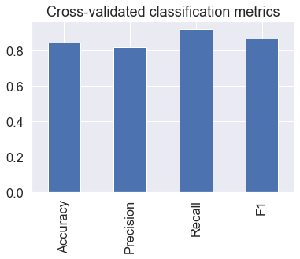
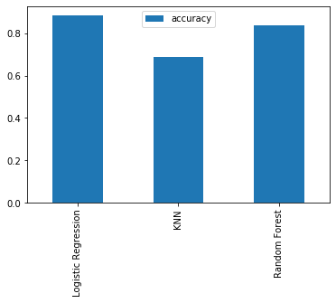

# Using Machine Learning to Classify Heart Diseases
This notebook (https://github.com/Lolchiii/heart-disease-classification-ml/blob/main/end-to-end-heart-disease-classification.ipynb) looks into using various Python-based machine learning and data science libraries in an attempt to build a machine learning model capable of predicting whether or not someone has heart disease based on their medical attributes.

